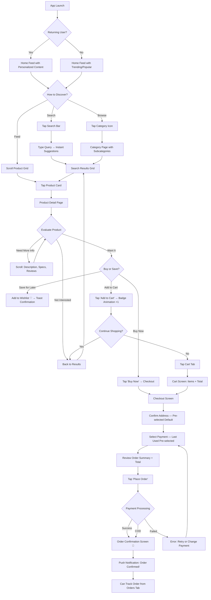
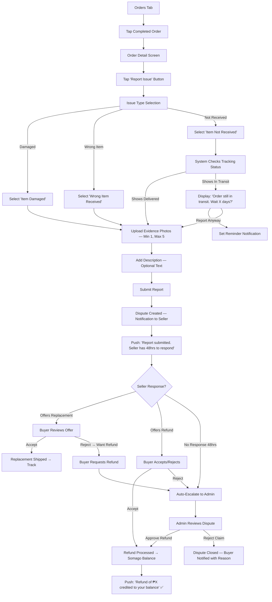
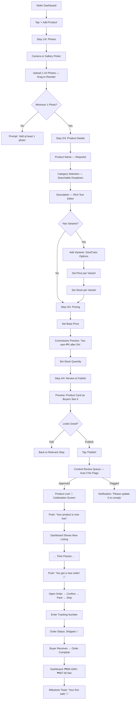
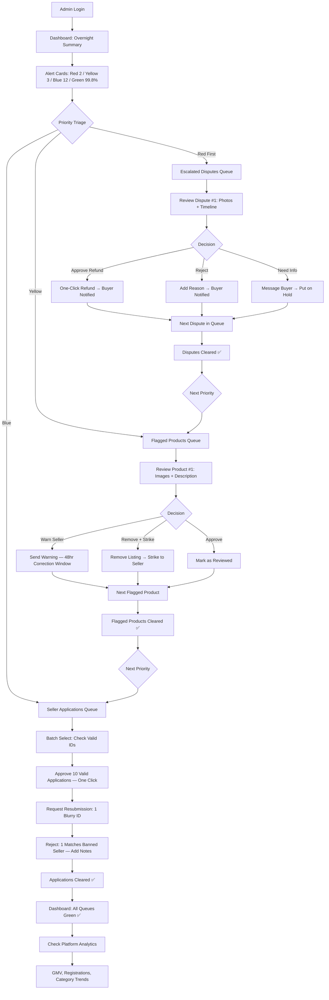

# UX Design Specification Somago

**Author:** deliveryboy
**Date:** 2026-03-15

---

## Executive Summary

### Project Vision

Somago is a multi-platform e-commerce marketplace delivering a Shopee-equivalent shopping experience for SEA buyers and sellers. The UX must support three distinct user roles — each with fundamentally different goals, mental models, and usage contexts — across web and mobile platforms with consistent feature parity. The design must feel trustworthy to first-time buyers, empowering to new sellers, and efficient for platform administrators.

### Target Users

**Maria — Mobile-First Buyer (Primary)**
- Age 22, student/young professional in Metro Manila
- Shops on mobile during commute; attention span is short, decisions are fast
- Price-conscious; drawn to deals, free shipping, and social proof (reviews/ratings)
- Prefers COD and e-wallets over credit cards
- UX expectation: Shopee-speed browsing, one-hand navigation, instant feedback on every action

**Rina — Small Business Seller (Primary)**
- Age 34, entrepreneur in Cebu transitioning from Facebook selling
- Not tech-savvy with dashboards; needs guided onboarding and simple workflows
- Core loop: list products → manage orders → check sales
- UX expectation: Zero-friction product listing, clear order pipeline, analytics that answer "what's selling?"

**Jay — Platform Admin (Secondary)**
- Age 28, ops team member managing marketplace health
- Processes high volumes: 10+ seller apps, multiple disputes, flagged content daily
- Needs batch actions, keyboard shortcuts, and priority-based task queues
- UX expectation: Dense information display, one-click actions, overnight summary dashboard

### Key Design Challenges

1. **Three-Role Complexity:** Three fundamentally different user experiences (shopping, selling, administrating) must share a consistent design system while serving completely different mental models and workflows
2. **Mobile-First Marketplace:** Product browsing, search, and checkout must be optimized for one-handed mobile use on mid-range Android devices over 4G — performance and touch targets are critical
3. **Trust Building on a New Platform:** Buyers need visible trust signals (verified sellers, review counts, buyer protection badges) since Somago has no brand recognition yet
4. **Seller Onboarding Friction:** Rina is coming from zero-tool (Facebook DMs) to a full dashboard — the transition must feel like simplification, not complexity
5. **Cross-Platform Consistency:** Web and mobile must feel like the same product while respecting platform-native patterns (bottom nav on mobile, sidebar on desktop)

### Design Opportunities

1. **Seller Onboarding as Competitive Edge:** A guided, step-by-step seller setup ("list your first product in 3 minutes") could differentiate Somago from Shopee's more complex seller center
2. **Mobile Checkout Speed:** Streamlined checkout with saved addresses, one-tap payment selection, and instant order confirmation can reduce cart abandonment below the 30% target
3. **Admin Efficiency Tools:** Batch review workflows, keyboard shortcuts, and smart priority queues could make Jay's Monday morning 2x faster than manual platform management
4. **Visual Trust Architecture:** Strategic placement of verified badges, review counts, buyer protection messaging, and order tracking transparency can build trust faster than competitors

## Core User Experience

### Defining Experience

**Primary Core Loop — Buyer Discovery to Purchase:**
The defining experience of Somago is the buyer's journey from "I want something" to "I bought it" in under 5 minutes. Every design decision prioritizes this loop: search/browse → discover product → evaluate (photos, reviews, price) → add to cart → checkout → confirmation. This loop must feel faster and more trustworthy than browsing Facebook Marketplace or Shopee.

**Secondary Core Loop — Seller List to Fulfill:**
Rina's core loop is listing a product and fulfilling her first order. The experience must feel simpler than posting on Facebook — upload photos, type a description, set a price, and go live. Order fulfillment should be a clear pipeline: new → confirmed → packed → shipped → done.

**Tertiary Core Loop — Admin Monitor to Act:**
Jay's core loop is scanning a dashboard, identifying what needs attention, and resolving it with minimal clicks. His experience is information-dense and action-oriented — the opposite of the buyer's visual, browsing-first experience.

### Platform Strategy

**Mobile-First, Web-Responsive:**
- Mobile (iOS + Android) is the primary platform — Maria shops on her phone during commute
- Web SPA is secondary for buyers but primary for sellers (product listing is easier with keyboard) and the only platform for admin
- Design mobile screens first, then adapt to larger breakpoints (768px, 1024px, 1440px)
- Touch targets minimum 44x44px on mobile; thumb-zone optimization for bottom navigation and primary actions

**Platform-Native Patterns:**
- **Mobile:** Bottom tab navigation (Home, Categories, Cart, Orders, Account), pull-to-refresh, swipe gestures, native share sheets
- **Web Desktop:** Left sidebar navigation for seller/admin dashboards, top search bar, hover states for product cards, keyboard shortcuts for admin
- **Shared:** Same visual language (colors, typography, iconography, component library) across all platforms

**Offline Considerations:**
- Product browsing cache for recently viewed items on mobile
- Cart persistence across sessions (synced server-side)
- Draft product listings saved locally for sellers with poor connectivity

### Effortless Interactions

**Zero-Thought Actions (must feel invisible):**
1. **Search to results:** Type → instant suggestions → tap → filtered results. No page reloads, no waiting
2. **Add to cart:** Single tap from product card or detail page. Visual feedback (cart badge animation), no navigation required
3. **Checkout:** Saved address auto-selected, last payment method pre-selected, one-tap "Place Order" button. Three screens maximum: cart → confirm → done
4. **Order tracking:** Open app → Orders tab → see status immediately. No searching, no tapping into details unless desired
5. **Product listing (seller):** Photo upload → auto-suggest category → fill details → publish. Guided flow, not a blank form

**Friction Reduction vs Competitors:**
- Skip "add to cart" with a "Buy Now" button for impulse purchases
- Phone number registration with OTP (no email verification wall)
- COD as default payment for users without e-wallets — no payment setup required for first purchase
- Seller onboarding: approve in 24hrs, not days — momentum matters for new sellers

### Critical Success Moments

1. **First Search Result (Buyer):** Maria searches and sees relevant, well-photographed products with prices and ratings in under 1 second. If results are empty, slow, or irrelevant — she leaves permanently
2. **First Add to Cart (Buyer):** The moment Maria taps "Add to Cart" and sees the satisfying animation — she's now invested. Cart icon badge must update instantly
3. **Order Confirmation (Buyer):** The confirmation screen with order number, estimated delivery, and "Track Order" button is the trust-building moment. Maria screenshots this — make it clean and shareable
4. **First Product Goes Live (Seller):** Rina sees her blouse listing appear on the platform with a beautiful product card. This is her "I'm a real online seller" moment — celebrate it with a congratulatory message
5. **First Order Notification (Seller):** Rina's phone buzzes with "You got an order!" — this is the dopamine moment that makes her list more products. The notification must be instant and clear
6. **Dispute Resolved (Buyer):** Maria sees "Refund credited" — trust in the platform is either cemented or broken here. Clear communication throughout the dispute process is critical

### Experience Principles

1. **Speed is Trust:** Every interaction must feel instant. Slow loading = untrustworthy platform. Skeleton screens, optimistic UI updates, and CDN-served images are non-negotiable
2. **Show, Don't Tell:** Product photos drive purchases. Large, high-quality images dominate product cards and detail pages. Reviews with photos rank higher. Trust badges are visual, not textual
3. **One-Hand, One-Thumb:** Mobile interactions must be completable with one thumb. Primary actions live in the bottom third of the screen. No precision tapping, no tiny buttons, no horizontal scrolling for critical flows
4. **Progressive Complexity:** Buyers see a simple shopping experience. Sellers see a simple dashboard that reveals more as they grow. Admins see dense data. Complexity scales with the role, never with the user's first impression
5. **Celebrate Milestones:** First purchase, first product listed, first sale, 100th order — acknowledge user milestones to build emotional connection and retention

## Desired Emotional Response

### Primary Emotional Goals

**For Maria (Buyer):**
- **Trust & Safety:** "My money is safe here, and I'll get what I ordered" — the #1 emotional barrier for any new marketplace
- **Excitement & Discovery:** "Ooh, there's so much good stuff here!" — the dopamine of endless browsing and finding deals
- **Satisfaction & Control:** "That was easy, I know exactly where my order is" — post-purchase confidence

**For Rina (Seller):**
- **Empowerment:** "I'm running a real online business!" — the feeling of professionalism and growth beyond Facebook selling
- **Confidence:** "I know what's selling and what to do next" — clarity from analytics and a simple dashboard
- **Momentum:** "I just got another order!" — the addictive cycle of listing more → selling more

**For Jay (Admin):**
- **Efficiency & Mastery:** "I cleared my queue in 30 minutes" — the satisfaction of a clean inbox and fast resolutions
- **Informed Control:** "I know exactly what's happening on the platform" — confidence from real-time data

### Emotional Journey Mapping

| Stage | Buyer (Maria) | Seller (Rina) | Admin (Jay) |
|-------|--------------|---------------|-------------|
| **First Visit** | Curiosity + mild skepticism | Excitement + nervousness | Orientation + assessment |
| **Onboarding** | Ease ("that was fast") | Guided confidence ("I can do this") | Competence ("I see the tools") |
| **Core Action** | Excitement (browsing) → Decisiveness (buying) | Pride (listing) → Anticipation (waiting for sales) | Focus (scanning) → Satisfaction (resolving) |
| **Success Moment** | Delight (order confirmed, tracking works) | Thrill (first sale notification) | Accomplishment (queue cleared) |
| **Something Wrong** | Concern → Reassurance ("they've got my back") | Worry → Support ("I know what to do") | Urgency → Resolution ("handled") |
| **Return Visit** | Habit + anticipation ("what's new?") | Routine + growth ("let me check my sales") | Efficiency ("let me clear today's tasks") |

### Micro-Emotions

**Critical Micro-Emotions to Design For:**

| Micro-Emotion | Context | Design Response |
|--------------|---------|-----------------|
| **Confidence over Confusion** | Checkout flow, payment selection | Clear step indicators, price breakdown, no hidden fees |
| **Trust over Skepticism** | First purchase on new platform | Verified seller badges, review counts, buyer protection banner |
| **Excitement over Anxiety** | Waiting for delivery | Real-time tracking with map, proactive status notifications |
| **Accomplishment over Frustration** | Seller listing a product | Progress bar, auto-save drafts, success celebration screen |
| **Belonging over Isolation** | New user first session | Welcome flow, trending products ("others are buying this"), community signals |
| **Delight over Indifference** | Repeat use | Personalized home feed, "back in stock" alerts, milestone celebrations |

**Emotions to Actively Prevent:**
- **Buyer's remorse:** Transparent pricing, easy returns messaging, review visibility
- **Abandonment anxiety:** Cart persistence, checkout progress saving, "your cart is waiting" nudges
- **Seller overwhelm:** Simple dashboard defaults, progressive feature revelation, guided first-time flows
- **Admin burnout:** Batch actions, priority sorting, clear completion signals

### Design Implications

| Emotional Goal | UX Design Approach |
|---------------|-------------------|
| Trust & Safety | Buyer protection badge on every product page; verified seller checkmarks; order tracking with timeline visualization; clear refund policy links |
| Excitement & Discovery | Large product photos in grid layout; pull-to-refresh with new content; "flash deal" visual urgency (future); category-based browsing with visual thumbnails |
| Ease & Speed | Skeleton loading screens (never blank white); optimistic UI (cart updates before server confirms); minimal form fields; smart defaults everywhere |
| Empowerment (Seller) | "Your Shop" dashboard with personal greeting; sales graph that shows growth over time; "You've sold X items!" milestone toasts |
| Efficiency (Admin) | Color-coded priority badges (red/yellow/green); batch select checkboxes; keyboard shortcut hints; "X items resolved today" counter |
| Reassurance (Error States) | Friendly error messages with clear next steps; "We're on it" messaging for disputes; automatic retry for failed payments with user notification |

### Emotional Design Principles

1. **Never Leave Users Wondering:** Every action gets immediate visual feedback — loading spinners, success animations, error messages with solutions. Silence breeds anxiety
2. **Celebrate Before Selling:** Congratulate Rina on her first listing before suggesting "list more products." Acknowledge Maria's purchase before cross-selling. Let the moment breathe
3. **Protect Before Promoting:** Show buyer protection messaging and return policies before pushing promotions. Trust must be established before commerce can thrive
4. **Human in the Machine:** Use warm, conversational microcopy ("You're all set!" not "Order #38291 processed"). Error messages should feel like a helpful friend, not a system alert
5. **Momentum Over Perfection:** Help Rina list an imperfect product fast rather than demanding a perfect listing slowly. Help Maria buy quickly rather than over-informing. Speed creates emotional investment

## UX Pattern Analysis & Inspiration

### Inspiring Products Analysis

**Shopee (Primary Reference):**
- **Core Strength:** Gamified, addictive mobile shopping experience optimized for SEA markets
- **Onboarding:** Phone number → OTP → immediately browsing. Under 30 seconds to first product view
- **Navigation:** Bottom tab bar (Home, Mall, Live, Notifications, Me) — simple, thumb-friendly, always accessible
- **Product Discovery:** Infinite scroll feed with deal badges, flash sale countdown timers, and "coins" gamification that keeps users scrolling
- **Checkout:** Streamlined — saved addresses, saved payment methods, voucher auto-apply. COD prominent for unbanked users
- **Trust Signals:** Star ratings on every product card, "Preferred Seller" badges, Shopee Guarantee banner, review photos
- **What makes it sticky:** Daily check-in rewards, flash sales creating urgency, free shipping thresholds, push notifications for price drops

**Lazada (Secondary Reference):**
- **Core Strength:** More structured, brand-oriented shopping experience with cleaner product hierarchy
- **Category Architecture:** Well-organized mega-menu with visual category icons — easier to browse by department than Shopee's feed-first approach
- **Product Pages:** Cleaner layout with more prominent brand information, specifications tables, and structured product descriptions
- **Search Experience:** More refined filters with structured attributes (brand, material, size) vs Shopee's looser tag-based filtering
- **LazMall:** Clear separation between verified brand stores and marketplace sellers — builds premium trust
- **Checkout:** Similar to Shopee but with stronger wallet integration (LazWallet) and installment payment options displayed upfront
- **What to learn:** Structured product information architecture and cleaner category navigation give buyers more confidence in what they're purchasing

**TikTok Shop (Tertiary Reference):**
- **Core Strength:** Discovery-driven commerce — users find products they didn't know they wanted through video content
- **Product Discovery:** Content-first, not search-first. Products surface through entertaining videos, not category browsing
- **Social Proof:** Live view counts, real-time comments, creator testimonials replace traditional star ratings as trust signals
- **Impulse Purchase Flow:** "Buy Now" button overlaid on video — one tap from discovery to purchase with minimal friction
- **Seller Experience:** Creators/sellers produce video content that doubles as marketing and product demonstration — lowers the barrier between "seeing" and "buying"
- **What to learn:** The power of visual-first product presentation and the emotional impulse buy triggered by seeing a product in use, not just photographed

### Transferable UX Patterns

**Navigation Patterns:**
| Pattern | Source | Somago Application |
|---------|--------|-------------------|
| Bottom tab bar with 5 tabs | Shopee | Home, Categories, Cart, Orders, Account — buyer mobile navigation |
| Visual category grid with icons | Lazada | Category browsing page with illustrated icons per department |
| Persistent search bar at top | All three | Always-visible search bar on every screen — the fastest path to any product |
| Floating cart button | TikTok Shop | Persistent cart access from product pages without navigating away |

**Interaction Patterns:**
| Pattern | Source | Somago Application |
|---------|--------|-------------------|
| OTP phone login (no password) | Shopee | Primary registration and login — matches SEA user behavior |
| Pull-to-refresh product feed | Shopee/TikTok | Home feed refreshes with new products and deals |
| Swipe product image gallery | All three | Horizontal swipe through product photos on detail page |
| One-tap "Add to Cart" from grid | Shopee | Cart icon overlay on product cards for fast adding without opening detail page |
| Inline variant selector | Lazada | Size/color selection as tappable pills on product detail page |
| Sticky "Buy Now / Add to Cart" bar | All three | Fixed bottom bar on product detail page — always visible CTA |

**Visual Patterns:**
| Pattern | Source | Somago Application |
|---------|--------|-------------------|
| Product card with price + rating + sold count | Shopee | Standard product card layout: image, name, price, stars, "X sold" |
| Deal badge overlays (% off, free shipping) | Shopee | Red/orange badges on product card corners for discounts |
| Structured spec tables | Lazada | Product specifications in clean key-value table layout |
| Video thumbnail on product images | TikTok Shop | Allow sellers to add short product videos alongside photos |
| Order status timeline (vertical) | Shopee/Lazada | Visual step-by-step timeline showing order progress |

**Trust Patterns:**
| Pattern | Source | Somago Application |
|---------|--------|-------------------|
| "Buyer Protection" banner | Shopee | Prominent guarantee banner on checkout and product pages |
| Verified seller badge | Lazada (LazMall) | Checkmark badge next to verified seller names |
| Review photos grid | Shopee | Buyer-uploaded photos displayed in grid below text reviews |
| "X people are viewing this" | TikTok Shop | Social proof indicator on popular product pages |

### Anti-Patterns to Avoid

1. **Shopee's Visual Overload:** Shopee's home screen is cluttered with banners, flash sales, coins, games, and promotions fighting for attention. Somago should start cleaner — introduce complexity gradually as the platform grows
2. **Lazada's Deep Category Navigation:** Lazada's category mega-menu can be overwhelming with too many nested levels. Somago should limit to 2 levels deep (category → subcategory) for MVP
3. **TikTok Shop's Content Dependency:** TikTok Shop requires video content to drive discovery — this doesn't work without a creator ecosystem. Somago should not depend on user-generated video content for MVP; focus on photo-first product presentation
4. **Aggressive Push Notifications:** All three platforms over-notify users with promotional pushes. Somago should limit notifications to order updates and high-relevance alerts — earn notification trust before marketing through them
5. **Hidden Pricing:** Adding fees at checkout that weren't visible on the product page (shipping fees revealed late). Somago should show estimated total including shipping on the product card or detail page
6. **Forced App Downloads:** Lazada's web experience pushes app downloads aggressively. Somago's web experience should be fully functional without app-download walls
7. **Complex Seller Onboarding:** Shopee's seller center has a steep learning curve for first-time sellers. Somago should offer a guided wizard, not a dashboard dump

### Design Inspiration Strategy

**What to Adopt Directly:**
- Shopee's bottom tab navigation and product card layout — proven, familiar to SEA users
- Shopee's OTP-based phone registration — matches local user behavior
- Lazada's structured product specifications — builds buyer confidence
- Shopee's order tracking timeline — clear, visual, reduces support inquiries
- Shopee's sticky "Buy Now / Add to Cart" bottom bar — proven conversion pattern

**What to Adapt:**
- Shopee's home feed → cleaner version with less visual noise, more breathing room between sections
- Lazada's category architecture → simplified to 2-level depth with visual icons
- TikTok Shop's visual-first product presentation → support product videos alongside photos, but don't require them
- Shopee's review system → adopt photo reviews but add "verified purchase" badge prominently
- Lazada's brand store concept → adapt as "verified seller" shops with custom branding (future phase)

**What to Intentionally Avoid:**
- Gamification features (coins, daily games, spin wheels) — too complex for MVP, adds visual clutter
- Social feed / live selling features — requires content ecosystem that doesn't exist yet
- Aggressive promotional UI (countdown timers, flashing deals) — start clean, add urgency features in Phase 2
- Complex multi-voucher stacking — confuses users and complicates checkout

## Design System Foundation

### Design System Choice

**Themeable System: Tailwind CSS (Web) + NativeWind (React Native)**

A utility-first CSS framework shared across web and mobile through a common design token system. Tailwind CSS powers the Next.js web SPA, while NativeWind brings the same Tailwind classes to React Native — enabling a single design language across all platforms.

**Component Libraries:**
- **Web:** shadcn/ui (built on Radix UI + Tailwind) — accessible, unstyled primitives with Tailwind styling. Copy-paste components, not a dependency — full ownership and customization
- **Mobile:** Custom React Native components styled with NativeWind, following the same design tokens as web
- **Admin Dashboard (Web):** shadcn/ui with data table, command palette, and form components — optimized for dense information display

### Rationale for Selection

1. **Cross-Platform Consistency:** Tailwind + NativeWind share the same utility class naming convention — `bg-primary`, `text-lg`, `rounded-xl` work identically on web and mobile. One design language for the entire team
2. **Speed of Development:** Utility-first approach eliminates CSS file management, naming debates, and style conflicts. shadcn/ui provides production-ready components out of the box
3. **Full Customization:** Unlike Material UI or Ant Design, Tailwind is entirely themeable — Somago won't look like "another MUI app." Brand colors, typography, and spacing are defined once in `tailwind.config` and propagate everywhere
4. **Team-Friendly:** Tailwind has the largest community and documentation in the React ecosystem. Intermediate developers can be productive within hours, not days
5. **Performance:** Tailwind's purge mechanism ensures only used styles ship to production. No bloated CSS bundles from unused component library styles
6. **Accessibility:** shadcn/ui is built on Radix UI primitives — WAI-ARIA compliant out of the box, supporting WCAG 2.1 AA requirements from the PRD

### Implementation Approach

**Design Token Architecture:**
```
tailwind.config.js (shared source of truth)
├── colors: { primary, secondary, accent, success, warning, error, neutral }
├── typography: { fontFamily, fontSize scale, fontWeight }
├── spacing: { 4px base unit, consistent scale }
├── borderRadius: { sm, md, lg, xl, full }
├── shadows: { sm, md, lg for elevation }
└── breakpoints: { sm: 375px, md: 768px, lg: 1024px, xl: 1440px }
```

**Component Strategy:**
- **Shared Components (web + mobile):** Design tokens, color system, typography scale, spacing system, icon set
- **Web-Only Components:** shadcn/ui data tables (admin), mega-menu (categories), hover interactions
- **Mobile-Only Components:** Bottom tab bar, swipe gestures, pull-to-refresh, native share sheets
- **Platform-Adaptive Components:** Product cards, order timeline, seller dashboard widgets — same data, platform-native rendering

**Tech Stack Alignment:**
| Layer | Web | Mobile |
|-------|-----|--------|
| Framework | Next.js (React) | React Native + Expo |
| Styling | Tailwind CSS | NativeWind |
| Components | shadcn/ui (Radix) | Custom RN components |
| Icons | Lucide React | Lucide React Native |
| Forms | React Hook Form + Zod | React Hook Form + Zod |
| State | Zustand or TanStack Query | Same (shared) |

### Customization Strategy

**Brand Identity (To Be Defined):**
- **Primary Color:** Marketplace orange/coral (warm, energetic — similar to Shopee's orange but differentiated) — exact hex TBD during visual design
- **Secondary Color:** Deep teal or navy — trust, professionalism for seller/admin contexts
- **Accent Color:** Bright green — success states, "add to cart," positive actions
- **Neutral Palette:** Warm grays — softer than pure gray, approachable feel
- **Error/Warning:** Standard red/amber — universally understood

**Typography:**
- **Primary Font:** Inter or Plus Jakarta Sans — clean, modern, excellent screen readability, supports Filipino/SEA characters
- **Monospace:** JetBrains Mono — for order IDs, tracking numbers, admin data

**Component Customization Priority:**
1. Product Card — the most visible component, must feel unique to Somago
2. Navigation (bottom tab bar, search bar) — primary interaction surfaces
3. Buttons and CTAs — brand-colored, consistent across platforms
4. Order Timeline — trust-building component, needs polish
5. Seller Dashboard Widgets — data visualization, must feel professional

## Detailed Core Experience Design

### Defining Experience

**"Find it, buy it, track it"** — Somago's defining experience in three words.

For Maria: "I searched for a laptop sleeve, found one with great reviews for ₱350, bought it with COD, and tracked it until it arrived." The entire flow — from intent to delivery confirmation — must feel like a single, unbroken experience. No friction points, no dead ends, no moments of confusion.

For Rina: "I listed my products, and orders started coming in." The defining seller experience is the magical moment between listing a product and receiving the first order notification.

For Jay: "I opened my dashboard, saw what needed attention, and cleared it." Admin efficiency is defined by time-to-resolution, not feature richness.

### User Mental Model

**Buyer Mental Model (Maria):**
- Thinks in terms of "shopping" not "using an app" — the product is invisible, the shopping is the experience
- Expects Shopee-like behavior: bottom tabs, search at top, product grids, swipe-through photos
- Trust is earned through visual signals: star ratings, "X sold," verified badges, review photos
- Payment mental model: "I pick how I pay at the end" — COD is not a fallback, it's the primary method for many SEA users
- Delivery mental model: "I should know where my order is at all times" — order tracking is not a feature, it's a core expectation

**Seller Mental Model (Rina):**
- Thinks in terms of "my shop" — the dashboard should feel like her business headquarters
- Expects simplicity comparable to posting on Facebook Marketplace — upload photos, write description, set price
- Order mental model: a pipeline with clear stages (new → confirmed → packed → shipped → done) — she needs to know "what do I do next?"
- Analytics mental model: "am I doing well?" — she doesn't want charts, she wants answers ("your best seller this week is...")

**Admin Mental Model (Jay):**
- Thinks in terms of "queues" and "tasks" — his dashboard is a to-do list, not an information display
- Expects batch processing — reviewing 12 seller applications one-by-one is failure; selecting 10 and approving in one click is success
- Priority mental model: red = urgent, yellow = needs attention, green = healthy — color-coded status drives his workflow
- Resolution mental model: "did I handle everything?" — he needs a clear "done for today" signal

### Success Criteria

**Buyer Core Experience Success:**
| Criteria | Measurement |
|----------|-------------|
| Search returns relevant results | First result matches intent 80%+ of the time |
| Product evaluation is fast | Under 10 seconds from opening product page to "Add to Cart" decision |
| Checkout feels effortless | 3 screens or fewer from cart to confirmation |
| Payment selection is clear | User picks payment method without confusion or hesitation |
| Order confirmation builds trust | User screenshots confirmation (shareable, clean design) |
| Tracking reduces anxiety | User checks tracking no more than 2x per order (confidence, not worry) |

**Seller Core Experience Success:**
| Criteria | Measurement |
|----------|-------------|
| First product listed fast | Under 3 minutes from "new listing" to "published" |
| Order pipeline is clear | Seller knows next action within 2 seconds of seeing an order |
| Analytics answer questions | "What's selling?" answered on dashboard without clicking into reports |

**Admin Core Experience Success:**
| Criteria | Measurement |
|----------|-------------|
| Morning queue assessed fast | Under 1 minute to scan overnight summary and prioritize |
| Batch actions work | 10+ items processed in a single action flow |
| Resolution is one-click | Dispute approved/rejected without navigating to secondary screens |

### Novel UX Patterns

**Pattern Strategy: Established with Polish**

Somago uses entirely established e-commerce UX patterns — no novel interactions that require user education. The competitive advantage is in **execution quality**, not pattern novelty.

**Established Patterns Adopted:**
- Bottom tab navigation (Shopee/Lazada standard)
- Product card grid with infinite scroll (universal e-commerce)
- Swipe-through product image gallery (universal mobile)
- Sticky bottom CTA bar on product pages (Shopee/Lazada/TikTok Shop)
- Vertical order tracking timeline (Shopee/Lazada standard)
- OTP phone login (SEA standard)
- Pull-to-refresh (mobile standard)

**Polish Differentiators (same pattern, better execution):**
- Cleaner product cards than Shopee — less visual noise, more breathing room
- Faster search suggestions — instant as-you-type with category hints
- Smarter checkout defaults — last address and payment method pre-selected
- Guided seller onboarding — step-by-step wizard vs. Shopee's dashboard dump
- Priority-sorted admin queue — vs. chronological listing on other platforms

### Experience Mechanics

**Buyer: Search → Buy Flow (6 Steps)**

```
1. INITIATE: Maria taps search bar (always visible, top of every screen)
   → Keyboard opens, recent searches shown, trending searches suggested

2. SEARCH: Types "laptop sleeve"
   → Instant suggestions dropdown after 2 characters
   → Tap suggestion or submit search

3. DISCOVER: Results grid loads (2-column on mobile, 4-column desktop)
   → Each card: product photo, name, price, stars, "X sold"
   → Filter bar: Price, Rating, Category — collapsible on mobile
   → Infinite scroll loads more results

4. EVALUATE: Taps product card → Product detail page
   → Swipeable photo gallery (full-width on mobile)
   → Price + variants (size/color as tappable pills)
   → Star rating + review count + "X sold"
   → Sticky bottom bar: "Add to Cart" | "Buy Now"
   → Scroll down: description, specs, reviews with photos

5. PURCHASE: Taps "Add to Cart" → cart badge animates (+1)
   → Taps cart tab → Cart screen with item list + total
   → Taps "Checkout" → Confirm screen: address (pre-selected) + payment (pre-selected) + order summary
   → Taps "Place Order" → Processing spinner (< 2 seconds)

6. CONFIRM: Order confirmation screen
   → Order number, items, total, estimated delivery
   → "Track Order" button prominent
   → Push notification: "Order confirmed!"
```

**Seller: List Product Flow (5 Steps)**

```
1. INITIATE: Rina taps "+" or "Add Product" on seller dashboard
   → Guided wizard opens (not a blank form)

2. PHOTOS: "Add photos of your product" (step 1 of 4 progress bar)
   → Camera or gallery picker, drag to reorder, first photo = cover
   → Minimum 1, recommended 3-5, max 10

3. DETAILS: "Describe your product" (step 2 of 4)
   → Product name, category (auto-suggested from photo AI in future), description
   → Variants: add size/color options with individual pricing

4. PRICING: "Set your price" (step 3 of 4)
   → Price per variant, stock quantity per variant
   → Commission preview: "You'll earn ₱X per sale after 5% commission"

5. PUBLISH: "Review and publish" (step 4 of 4)
   → Preview of product card as buyers will see it
   → "Publish" button → celebration animation → "Your product is live!"
```

## Visual Design Foundation

### Color System

**Primary Palette — Green Family:**

| Token | Hex | Usage |
|-------|-----|-------|
| `primary-50` | #ECFDF5 | Background tints, hover states |
| `primary-100` | #D1FAE5 | Light backgrounds, selected states |
| `primary-200` | #A7F3D0 | Badges, tags, progress bars |
| `primary-300` | #6EE7B7 | Secondary buttons, active indicators |
| `primary-400` | #34D399 | Icons, links, interactive elements |
| `primary-500` | #10B981 | **Primary brand color** — CTAs, navigation highlights, brand identity |
| `primary-600` | #059669 | Primary button default, header accent |
| `primary-700` | #047857 | Primary button hover, active states |
| `primary-800` | #065F46 | Dark accents, footer background |
| `primary-900` | #064E3B | Deep contrast, text on light backgrounds |

**Secondary Palette — Dark Teal/Emerald:**

| Token | Hex | Usage |
|-------|-----|-------|
| `secondary-500` | #0D9488 | Seller dashboard accents, secondary CTAs |
| `secondary-700` | #0F766E | Seller/admin header backgrounds |
| `secondary-900` | #134E4A | Admin dashboard dark theme elements |

**Semantic Colors:**

| Token | Hex | Usage |
|-------|-----|-------|
| `success` | #22C55E | Order confirmed, payment success, product published |
| `warning` | #F59E0B | Low stock alerts, pending actions, attention needed |
| `error` | #EF4444 | Failed payments, validation errors, critical alerts |
| `info` | #3B82F6 | Informational banners, help tooltips |
| `accent-orange` | #F97316 | Sale badges, discount tags, "HOT" indicators — warm contrast against green |
| `accent-yellow` | #EAB308 | Star ratings, coin rewards (future), highlight |

**Neutral Palette — Warm Grays:**

| Token | Hex | Usage |
|-------|-----|-------|
| `neutral-50` | #FAFAF9 | Page backgrounds |
| `neutral-100` | #F5F5F4 | Card backgrounds, input fields |
| `neutral-200` | #E7E5E4 | Borders, dividers |
| `neutral-300` | #D6D3D1 | Disabled states, placeholder text |
| `neutral-500` | #78716C | Secondary text, captions |
| `neutral-700` | #44403C | Body text |
| `neutral-900` | #1C1917 | Headings, primary text |
| `white` | #FFFFFF | Card surfaces, modals, input backgrounds |

**Color Strategy Rationale:**
- **Green as primary** conveys trust, growth, and money/commerce — ideal for a marketplace where buyers spend and sellers earn
- **Orange as accent** provides warm contrast for deals and urgency — visually pops against green without clashing (complementary color pair)
- **Warm grays** instead of cool grays create a friendlier, more approachable feel than clinical blue-gray palettes
- **Teal secondary** differentiates seller/admin contexts from buyer green — same family, different role

**Role-Based Color Application:**
| Context | Primary Color | Accent |
|---------|--------------|--------|
| Buyer App | Green-500 (#10B981) | Orange for deals/badges |
| Seller Dashboard | Teal-700 (#0F766E) | Green for success states |
| Admin Dashboard | Teal-900 (#134E4A) | Red/Yellow/Green priority badges |

### Typography System

**Font Selection:**

| Role | Font | Weight | Rationale |
|------|------|--------|-----------|
| **Primary** | Plus Jakarta Sans | 400, 500, 600, 700 | Modern, geometric, excellent readability at small sizes on mobile. Supports Latin Extended (Filipino). Free on Google Fonts |
| **Monospace** | JetBrains Mono | 400 | Order IDs, tracking numbers, admin data tables. Clear distinction between O/0 and l/1 |

**Type Scale (Mobile-First):**

| Token | Size | Weight | Line Height | Usage |
|-------|------|--------|-------------|-------|
| `display` | 28px | 700 | 1.2 | Hero banners, promotional headers |
| `h1` | 24px | 700 | 1.3 | Page titles ("Search Results", "My Orders") |
| `h2` | 20px | 600 | 1.3 | Section headers ("Reviews", "Similar Products") |
| `h3` | 16px | 600 | 1.4 | Card titles, subsection headers |
| `body` | 14px | 400 | 1.5 | Product descriptions, body text |
| `body-sm` | 13px | 400 | 1.5 | Secondary information, captions |
| `caption` | 12px | 400 | 1.4 | Timestamps, metadata, helper text |
| `label` | 12px | 600 | 1.3 | Form labels, badge text, tab labels |
| `price` | 16px | 700 | 1.2 | Product prices — always bold, always prominent |
| `price-lg` | 20px | 700 | 1.2 | Product detail page price |

**Desktop Scale Adjustments:**
- `display`: 36px, `h1`: 28px, `h2`: 22px — scale up ~15-25% for larger screens
- Body text remains 14px — proven readable on desktop

### Spacing & Layout Foundation

**Base Unit: 4px**

| Token | Value | Usage |
|-------|-------|-------|
| `space-1` | 4px | Tight spacing (between icon and label) |
| `space-2` | 8px | Default inner padding (badge, tag) |
| `space-3` | 12px | Input padding, small gaps |
| `space-4` | 16px | Card inner padding, section gaps |
| `space-5` | 20px | Between cards in grid |
| `space-6` | 24px | Section separation |
| `space-8` | 32px | Major section gaps |
| `space-10` | 40px | Page-level vertical spacing |
| `space-12` | 48px | Bottom tab bar height |
| `space-16` | 64px | Header height |

**Layout Grid:**

| Breakpoint | Columns | Gutter | Margin | Product Grid |
|-----------|---------|--------|--------|-------------|
| Mobile (375px) | 4 | 16px | 16px | 2-column |
| Tablet (768px) | 8 | 20px | 24px | 3-column |
| Desktop (1024px) | 12 | 24px | 32px | 4-column |
| Wide (1440px) | 12 | 24px | auto (max 1280px) | 5-column |

**Border Radius:**

| Token | Value | Usage |
|-------|-------|-------|
| `rounded-sm` | 4px | Tags, badges, small buttons |
| `rounded-md` | 8px | Cards, inputs, standard buttons |
| `rounded-lg` | 12px | Modals, bottom sheets, large cards |
| `rounded-xl` | 16px | Image containers, hero sections |
| `rounded-full` | 9999px | Avatars, circular buttons, pills |

**Elevation (Shadows):**

| Token | Shadow | Usage |
|-------|--------|-------|
| `shadow-sm` | 0 1px 2px rgba(0,0,0,0.05) | Cards, subtle lift |
| `shadow-md` | 0 4px 6px rgba(0,0,0,0.07) | Dropdowns, popovers |
| `shadow-lg` | 0 10px 15px rgba(0,0,0,0.1) | Modals, bottom sheets, sticky headers |

### Accessibility Considerations

**Color Contrast Compliance (WCAG 2.1 AA):**

| Combination | Ratio | Status |
|------------|-------|--------|
| neutral-900 on white | 15.4:1 | Pass (AAA) |
| neutral-700 on white | 9.7:1 | Pass (AAA) |
| primary-600 on white | 4.6:1 | Pass (AA) |
| primary-500 on white | 3.4:1 | Fail for text — use on large text/icons only |
| white on primary-600 | 4.6:1 | Pass (AA) — button text |
| white on primary-700 | 5.8:1 | Pass (AA) — button text |
| error on white | 4.6:1 | Pass (AA) |

**Accessibility Rules:**
- Body text always uses neutral-700 or neutral-900 — never primary colors for paragraph text
- Primary-500 used only for large text (18px+), icons, and decorative elements
- All interactive green elements use primary-600 or darker for text contrast
- Focus rings: 2px solid primary-500 with 2px offset — visible on all backgrounds
- Touch targets: minimum 44x44px on mobile, 36x36px on desktop
- Color is never the only indicator of state — always pair with icons, text, or patterns

## Design Direction Decision

### Design Directions Explored

Six design direction mockups were generated covering all three user roles:

**Buyer Home Screen:**
- **Direction A (Clean Home Feed):** Minimal, light background, 2-column product grid with category icons, green accents, breathing room between cards — Shopee-inspired but cleaner
- **Direction B (Bold Dark Header):** Dark emerald header (#064E3B) with white content area, horizontal product scroll, promotional banner — premium marketplace feel

**Buyer Detail Screens:**
- **Product Detail Page:** Full-width swipeable image gallery, sticky bottom CTA bar ("Add to Cart" | "Buy Now"), variant pills, verified seller row, trust signals prominent
- **Checkout Flow:** 3-step progress bar, saved address pre-selected, COD as default payment, order summary with buyer protection badge

**Professional Dashboards:**
- **Seller Dashboard:** Teal-themed (#0F766E) left sidebar navigation, personal greeting, stat cards (sales/orders/products), order pipeline table
- **Admin Dashboard:** Dark theme (#134E4A), color-coded priority queue (red/yellow/blue/green alert cards), batch action buttons, command palette search

### Chosen Direction

**"Clean Shopee with Personality"** — Direction A as the base with select elements from Direction B.

**Buyer Home Screen:** Direction A's clean 2-column product grid layout with:
- Direction B's branded "Somago" logo in header for identity
- Direction B's promotional banner section below categories for featured content
- Direction B's horizontal "Trending Now" scroll sections between grid rows for feed variety

**Product Detail Page:** As designed — full-width images, sticky CTA, trust signals, variant pills

**Seller Dashboard:** Teal-themed left sidebar layout — professional, clear, data-driven

**Admin Dashboard:** Dark theme with priority queue — dense, efficient, batch-action oriented

### Design Rationale

1. **Direction A's grid is proven:** 2-column product grid matches Shopee/Lazada convention — zero learning curve for SEA users. More products visible per screen drives browsing engagement
2. **Light theme builds trust:** New platforms need to feel safe and transparent. Dark themes can feel intimidating for first-time buyers on an unfamiliar marketplace
3. **Category icons above the fold:** Always-visible category row enables fast navigation without searching — critical for users who browse by department rather than keyword
4. **Direction B's brand elements add personality:** The logo header and promotional banners prevent Direction A from feeling too generic — gives Somago its own identity
5. **Role-appropriate themes:** Buyers get light/green (friendly, shopping), sellers get teal (professional, business), admins get dark (dense, efficient) — each role's visual context matches their mental model

### Implementation Approach

**Component Priority for Development:**

| Priority | Component | Direction | Platform |
|----------|-----------|-----------|----------|
| 1 | Product Card (2-col grid) | A | Web + Mobile |
| 2 | Bottom Tab Navigation | A | Mobile |
| 3 | Search Bar + Suggestions | A | Web + Mobile |
| 4 | Product Detail Page | Detail screen | Web + Mobile |
| 5 | Checkout Flow (3-step) | Checkout screen | Web + Mobile |
| 6 | Category Icon Row | A | Web + Mobile |
| 7 | Promotional Banner | B (borrowed) | Web + Mobile |
| 8 | Seller Dashboard Layout | Seller screen | Web (primary) + Mobile |
| 9 | Admin Dashboard Layout | Admin screen | Web only |
| 10 | Order Tracking Timeline | Detail screen | Web + Mobile |

**Design Artifact:** Full interactive mockup available at `_bmad-output/planning-artifacts/ux-design-directions.html`

## User Journey Flows

### Journey 1: Buyer Discovery to Purchase (Maria — Happy Path)

**Entry Point:** App launch or search bar tap
**Goal:** Find and buy a product in under 5 minutes



**Key UX Decisions:**
- Search suggestions appear after 2 characters — no submit required
- "Add to Cart" stays on current page (no navigation) — badge animation confirms
- "Buy Now" skips cart entirely — direct to checkout for impulse buyers
- Address and payment pre-selected from last order — 1-tap checkout for returning users
- COD never fails payment processing — instant confirmation
- Order confirmation designed to be screenshot-worthy (clean, shareable)

---

### Journey 2: Buyer Dispute & Refund (Maria — Edge Case)

**Entry Point:** Orders tab → specific order
**Goal:** Report issue and get resolution



**Key UX Decisions:**
- Issue type pre-categorized — no free-text required to start
- Photo evidence upload with preview before submit
- 48-hour auto-escalation is automatic — buyer doesn't need to follow up
- Dispute thread visible to buyer with real-time status updates
- Refund goes to Somago balance (not original payment) — faster, encourages platform retention

---

### Journey 3: Seller Product Listing & First Sale (Rina — Success Path)

**Entry Point:** Seller Dashboard → "Add Product"
**Goal:** List product and receive first order



**Key UX Decisions:**
- 4-step wizard with progress bar — never a blank form
- Auto-save drafts after each step — no lost work on poor connectivity
- Commission preview shown before publish — no surprises on payout
- Product card preview exactly as buyers will see it — WYSIWYG confidence
- Celebration animation on first publish and first sale — emotional milestone moments
- Order pipeline: clear next action at every stage (confirm → pack → ship)

---

### Journey 4: Admin Morning Operations (Jay — Batch Processing)

**Entry Point:** Admin Dashboard login
**Goal:** Clear overnight queue efficiently



**Key UX Decisions:**
- Color-coded alert cards drive priority order — red first, always
- One-click actions for common decisions (approve refund, approve application)
- Batch selection for seller applications — 10+ approvals in one action
- Banned seller auto-detection highlights suspicious applications
- "All Queues Green" state provides clear "done for today" signal
- Keyboard shortcuts for power users: `A` approve, `R` reject, `N` next

---

### Journey Patterns

**Common Patterns Across All Journeys:**

| Pattern | Description | Used In |
|---------|-------------|---------|
| **Progressive Disclosure** | Show essential info first, details on demand | Product detail, order detail, dispute detail |
| **Optimistic UI** | Update interface before server confirms | Add to cart, wishlist, order status |
| **Toast Confirmations** | Brief, non-blocking success messages | Cart add, wishlist save, publish, approval |
| **Sticky CTA Bar** | Primary action always visible at bottom | Product detail, checkout, listing wizard |
| **Step Progress** | Visual progress indicator for multi-step flows | Checkout (3 steps), product listing (4 steps) |
| **Auto-Escalation** | System handles timeouts without user intervention | Dispute 48hr escalation |
| **Batch Actions** | Select multiple items, apply single action | Admin approvals, flagged content |
| **Milestone Celebrations** | Acknowledge user achievements with animation | First listing, first sale, first purchase |

### Flow Optimization Principles

1. **Minimum Viable Steps:** Every flow should reach its goal in the fewest possible screens. Checkout: 3 screens. Product listing: 4 steps. Dispute report: 3 taps to submit
2. **Smart Defaults Everywhere:** Pre-select last-used address, last-used payment, most likely category. Every default that's correct saves the user a decision
3. **Error Prevention Over Error Recovery:** Validate inline as user types. Show commission preview before publish. Confirm destructive actions (remove listing, ban user) with explicit confirmation
4. **Parallel Paths:** "Buy Now" bypasses cart for impulse buyers. "Add to Cart" enables comparison shopping. Both paths reach checkout — user chooses speed vs. deliberation
5. **Clear Exit Ramps:** Every flow has a visible way to go back, save draft, or cancel without losing work. No dead ends, no trapped states

## Component Strategy

### Design System Components

**Available from shadcn/ui (Web) — Used As-Is:**

| Component | Usage in Somago |
|-----------|----------------|
| Button | Primary/secondary CTAs, form submissions |
| Input | Search bar, form fields, product listing inputs |
| Select | Category dropdowns, payment method, address selection |
| Dialog/Modal | Confirmation dialogs, dispute details, image preview |
| Toast | Cart add confirmation, publish success, error notifications |
| Badge | Status badges, discount labels, verified seller marks |
| Avatar | User profiles, seller shop icons |
| Tabs | Product detail sections, dashboard navigation |
| Table | Admin data tables, seller order lists |
| Dropdown Menu | Sort options, filter menus, admin actions |
| Card | Base component for product cards, stat cards, order cards |
| Skeleton | Loading states for all content areas |
| Sheet (Bottom) | Mobile filter panels, variant selection |
| Command | Admin command palette (⌘K search) |
| Checkbox | Batch selection in admin, filter checkboxes |
| Progress | Checkout steps, product listing wizard |
| Separator | Section dividers |

### Custom Components

**1. ProductCard**
- **Purpose:** Display a product in browse/search results grid
- **Content:** Product image, name (2-line clamp), price, original price (strikethrough), star rating, sold count, discount badge, free shipping badge
- **Actions:** Tap → product detail, cart icon overlay → add to cart, heart icon → wishlist
- **States:** Default, loading (skeleton), out-of-stock (grayed), wishlisted (filled heart)
- **Variants:** Grid card (2-col mobile), list card (horizontal for search), small card (horizontal scroll)
- **Accessibility:** Alt text on image, price announced with currency, rating as "X out of 5 stars"
- **Platform:** Web + Mobile

**2. BottomTabBar**
- **Purpose:** Primary navigation for buyer mobile app
- **Content:** 5 tabs — Home, Categories, Cart (with badge count), Orders, Account
- **States:** Active tab (green icon + label), inactive (gray), cart badge (red circle with count)
- **Variants:** Buyer tabs, Seller tabs (Dashboard, Orders, Products, Analytics, Shop)
- **Platform:** Mobile only

**3. StickyCtaBar**
- **Purpose:** Fixed bottom action bar on product detail and checkout pages
- **Content:** "Add to Cart" (outlined) + "Buy Now" (filled), or single "Place Order" button
- **States:** Default, loading (spinner), disabled (out of stock), success (checkmark animation)
- **Variants:** Dual-button (product detail), single-button (checkout), price-display (total)
- **Platform:** Web + Mobile

**4. OrderTimeline**
- **Purpose:** Visual step-by-step order progress tracking
- **Content:** Vertical timeline: Confirmed → Packed → Shipped → Out for Delivery → Delivered
- **States:** Completed (green check), current (green pulse), upcoming (gray), failed (red X)
- **Variants:** Compact (order list), expanded (order detail), mini (order card preview)
- **Platform:** Web + Mobile

**5. SellerStatCard**
- **Purpose:** Key metric display on seller dashboard
- **Content:** Label, value (large number), change indicator (↑12%), icon
- **States:** Default, loading, positive change (green), negative (red), neutral
- **Variants:** Standard, compact (mini row), chart (with sparkline)
- **Platform:** Web (primary) + Mobile (compact)

**6. AdminAlertCard**
- **Purpose:** Priority-coded summary card on admin dashboard
- **Content:** Count number, label, color-coded left border (red/yellow/blue/green)
- **States:** Urgent (red), attention (yellow), informational (blue), healthy (green)
- **Platform:** Web only

**7. AdminQueueItem**
- **Purpose:** Single actionable item in admin priority queue
- **Content:** Priority dot, description, timestamp, action button
- **States:** Unreviewed, in-progress, resolved (strikethrough), on-hold (muted)
- **Variants:** Dispute item, flagged product, seller application
- **Platform:** Web only

**8. CategoryIconGrid**
- **Purpose:** Horizontal scrollable row of category icons on buyer home
- **Content:** Category icon (emoji/illustration), category name label
- **Variants:** Home row (horizontal scroll), full-page grid (category page)
- **Platform:** Web + Mobile

**9. ReviewCard**
- **Purpose:** Individual buyer review on product detail page
- **Content:** Star rating, review text, reviewer name, date, photos, verified purchase badge
- **Variants:** Full (product detail), compact (preview)
- **Platform:** Web + Mobile

**10. SearchBar**
- **Purpose:** Primary product search with instant suggestions
- **Content:** Search icon, input, clear button, suggestion dropdown
- **States:** Default, focused, with suggestions, loading, no results
- **Variants:** Home (prominent), in-page (compact), category-scoped
- **Platform:** Web + Mobile

### Component Implementation Strategy

**Build Order:** Components built in order of buyer's critical path (search → browse → detail → checkout), then seller, then admin.

**Shared Design Tokens:** All custom components consume tokens from `tailwind.config.js` — colors, spacing, typography, radius, shadows. No hardcoded values.

**Documentation:** Storybook (web) for all states and variants. React Native showcase app for mobile components.

### Implementation Roadmap

**Phase 1 — Core Buyer Path (Sprint 1-2):**
ProductCard (P0), SearchBar (P0), BottomTabBar (P0), StickyCtaBar (P0), CategoryIconGrid (P1)

**Phase 2 — Purchase Completion (Sprint 3-4):**
OrderTimeline (P0), ReviewCard (P1), Toast notifications (P1)

**Phase 3 — Seller Experience (Sprint 5-6):**
SellerStatCard (P0), Product listing wizard steps (P0)

**Phase 4 — Admin Experience (Sprint 7-8):**
AdminAlertCard (P0), AdminQueueItem (P0), Admin data tables (P0)

## UX Consistency Patterns

### Button Hierarchy

**Three-Tier Button System:**

| Tier | Style | Usage | Example |
|------|-------|-------|---------|
| **Primary** | Filled green (primary-600), white text, rounded-md | One per screen — the main action | "Place Order", "Publish", "Buy Now" |
| **Secondary** | Outlined green (primary-600 border), green text | Supporting action alongside primary | "Add to Cart", "Save Draft", "Message Seller" |
| **Tertiary** | Text-only green, no border | Low-priority actions, navigation links | "Change address", "See all", "View details" |
| **Destructive** | Filled red (error), white text | Irreversible actions requiring confirmation | "Remove Listing", "Ban User" |
| **Ghost** | Text-only neutral-500 | Least emphasis, cancel actions | "Cancel", "Skip", "Not now" |

**Button Rules:**
- Maximum 1 primary button visible per screen/section
- Destructive buttons always require confirmation dialog
- Button minimum height: 44px mobile, 36px desktop
- Button text: sentence case, action verb first ("Place Order" not "Order Placement")
- Loading state: spinner replaces text, button disabled, same width maintained

### Feedback Patterns

**Toast Notifications:**

| Type | Icon | Color | Duration | Usage |
|------|------|-------|----------|-------|
| **Success** | ✓ | Green (success) | 3 seconds | Cart add, order placed, product published |
| **Error** | ✕ | Red (error) | Persistent | Payment failed, upload error |
| **Warning** | ⚠ | Amber (warning) | 5 seconds | Low stock, session expiring |
| **Info** | ℹ | Blue (info) | 4 seconds | Feature tips, status updates |

**Toast Rules:**
- Position: top-center on mobile, top-right on desktop
- Maximum 1 toast visible — queue if multiple
- Success toasts auto-dismiss; error toasts require manual dismiss
- Max 2 lines, optional action link ("Undo", "View Order")

**Empty States:**
- Every empty list/grid has illustration + message + CTA
- Cart empty: "Your cart is empty" + "Start Shopping" button
- No search results: "No results for '[query]'" + "Try different keywords"
- No orders: "No orders yet" + "Browse Products" button
- Seller no products: "List your first product!" + "Add Product" button

**Loading States:**
- Skeleton screens for content areas (product grid, dashboard, order list)
- Spinner for actions (button loading, payment processing)
- Pull-to-refresh animation on mobile lists
- Never show blank white screens — always skeleton or shimmer

### Form Patterns

**Input Fields:**
- Label always visible above field (no floating labels)
- Placeholder text: example content, never instructions
- Required fields: red asterisk after label
- Error message: below field in red, appears on blur or submit
- Helper text: below field in neutral-500

**Form Layout:**
- Single column on mobile — always
- Two columns on desktop only for related fields (first/last name)
- Progress indicator for multi-step forms (checkout, product listing)

**Input Types:**
| Input | Pattern | Usage |
|-------|---------|-------|
| Text | Standard input with clear button | Product name, search, addresses |
| Number | Numeric keyboard on mobile, stepper buttons | Price, quantity, stock |
| Select | Bottom sheet on mobile, dropdown on desktop | Category, payment method |
| Photo upload | Grid preview with add button, drag to reorder | Product images, review photos |
| Phone | Country code prefix + number, auto-format | Registration, OTP |
| OTP | 6 separate digit boxes, auto-advance | Verification codes |

### Navigation Patterns

**Mobile Navigation:**
- **Primary:** Bottom tab bar (5 tabs) — always visible except full-screen flows
- **Secondary:** Top header with back arrow + page title + action icons
- **Tertiary:** In-page tabs (product detail: Description / Specs / Reviews)
- **Contextual:** Sticky bottom CTA bar on action pages

**Web Navigation:**
- **Buyer:** Top bar with logo + search + icons. Category mega-menu below
- **Seller:** Left sidebar with icon + label. Top bar with shop name + notifications
- **Admin:** Compact left sidebar (icons only, expand on hover). Top bar with search

**Back Navigation:**
- Mobile: back arrow in top-left, always present. Swipe-right on iOS
- Multi-step flows: back goes to previous step, not previous page
- Confirmation before leaving with unsaved changes

### Modal & Overlay Patterns

**Bottom Sheets (Mobile):** Variant selection, filters, sort, quick actions. Swipe down to dismiss. Max 70% screen height.

**Dialogs:** Destructive confirmations, dispute details, image preview. Center-screen, backdrop dimmed. Destructive dialogs: red button, explicit action text.

**Image Viewer:** Full-screen overlay, swipe navigation, pinch to zoom on mobile, arrow keys on desktop.

### Search & Filter Patterns

**Search:** Instant suggestions after 2 characters (300ms debounce). Recent searches on focus (max 5). Trending searches below. Category-scoped option.

**Filters:** Mobile: full-screen bottom sheet with "Apply" button. Desktop: collapsible sidebar with instant-apply. Active filters as removable pills.

**Sort:** Default relevance (search) or newest (browse). Options: price, rating, best selling, newest.

### Microcopy Patterns

**Tone:** Friendly, concise, action-oriented.

| Context | Pattern | Example |
|---------|---------|---------|
| **Success** | Celebration + next action | "Order placed! Track your delivery →" |
| **Error** | What happened + how to fix | "Payment failed. Try a different method or use COD." |
| **Empty** | Friendly + CTA | "No reviews yet. Be the first to share!" |
| **Confirmation** | Explicit action | "Remove this listing? Buyers won't see it anymore." |
| **Milestone** | Celebration + encouragement | "Your first sale! Keep listing to grow your shop." |

**Rules:** Max 2 lines for toasts. Use "you/your". Verb-first buttons. Never blame the user.

## Responsive Design & Accessibility

### Responsive Strategy

**Mobile-First Design Approach:**
Design for 375px mobile screens first, then progressively enhance for larger screens.

**Device-Specific Strategy:**

| Device | Strategy | Key Adaptations |
|--------|----------|-----------------|
| **Mobile (375px)** | Primary design target | Single column, bottom tab nav, full-width images, sticky CTA, thumb-zone |
| **Tablet (768px)** | Enhanced mobile | 3-column product grid, split-view seller dashboard, touch-optimized |
| **Desktop (1024px)** | Full experience | 4-column grid, persistent sidebar nav, hover states, keyboard shortcuts |
| **Wide (1440px)** | Max-width contained | 5-column grid, 1280px max-width centered, increased whitespace |

**Layout Adaptation Rules:**

| Component | Mobile | Tablet | Desktop |
|-----------|--------|--------|---------|
| Product grid | 2 columns | 3 columns | 4-5 columns |
| Navigation | Bottom tab bar | Bottom tab bar | Top bar + side nav |
| Search | Tap to expand | Persistent header | Persistent header |
| Filters | Full-screen bottom sheet | Side panel overlay | Persistent sidebar |
| Product images | Full-width swipe | Large left gallery | 60/40 split |
| Checkout | Single column stacked | Single column wider | Two-column |
| Seller dashboard | Stacked cards, bottom nav | Sidebar + content | Sidebar + content + widgets |
| Admin dashboard | Stacked priority cards | 2-column grid | 4-column alerts + queue |

### Breakpoint Strategy

**Tailwind Breakpoints (Mobile-First):**
- `sm`: 375px — Small phones (iPhone SE, budget Androids)
- `md`: 768px — Tablets, large phones landscape
- `lg`: 1024px — Laptops, small desktops
- `xl`: 1440px — Large desktops, external monitors

**Principles:** Content reflows, never hides. Images resize via `srcset`. Touch targets 44px minimum on all touch screens. No horizontal scrolling on any breakpoint.

### Accessibility Strategy

**Compliance Target: WCAG 2.1 Level AA**

| Category | Requirement | Implementation |
|----------|-------------|----------------|
| **Color Contrast** | 4.5:1 body text, 3:1 large text/UI | primary-600+ for text on white |
| **Keyboard Navigation** | All interactions via keyboard | Tab order = visual order, Enter/Space activate, Escape closes |
| **Screen Readers** | All content announced correctly | Semantic HTML, ARIA labels, alt text, live regions |
| **Touch Targets** | Min 44x44px mobile, 36x36px desktop | Enforced in all component specs |
| **Focus Indicators** | Visible focus ring on all interactive elements | 2px solid primary-500, 2px offset |
| **Motion** | Respect prefers-reduced-motion | Disable animations when user prefers |
| **Text Scaling** | 200% zoom without horizontal scroll | Relative units (rem), fluid layouts |

**ARIA Patterns:** Combobox (SearchBar), Tablist (BottomTabBar), Dialog (Modals), Alert (Toasts), Progressbar (Checkout/Listing wizard)

### Testing Strategy

**Automated:** axe-core in CI/CD (blocks on AA violations), Lighthouse 90+ score, ESLint jsx-a11y plugin

**Manual Checklist Per Feature:**
- Complete flow keyboard-only
- Navigate with VoiceOver (iOS) and TalkBack (Android)
- Verify at 200% zoom
- Check color contrast
- Test with prefers-reduced-motion
- Verify all images have alt text

**Device Testing Matrix:**
iPhone 13/14 Safari (P0), Samsung Galaxy A Chrome (P0), iPad Safari (P1), Desktop Chrome (P0), Desktop Firefox (P1), Desktop Safari (P1), Desktop Edge (P2)

### Implementation Guidelines

1. **HTML First:** Semantic elements before ARIA — `<button>` not `<div onClick>`, `<nav>` not `<div class="nav">`
2. **Focus Management:** Trap focus in modals, return focus on close, focus first element on step change
3. **Dynamic Content:** `aria-live` for toasts, cart updates, search counts. `aria-busy` for loading
4. **Images:** All `` require `alt`. Decorative = `alt=""`. Products use product name. Reviews use "Review photo by [name]"
5. **Forms:** Visible `<label>` for every input. Errors linked via `aria-describedby`. Required via `aria-required`
6. **Color Independence:** Never color alone — error: red border + icon + text. Status: color + label. Priority: color + tooltip
